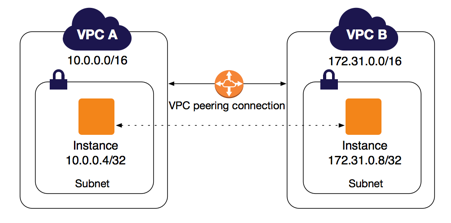
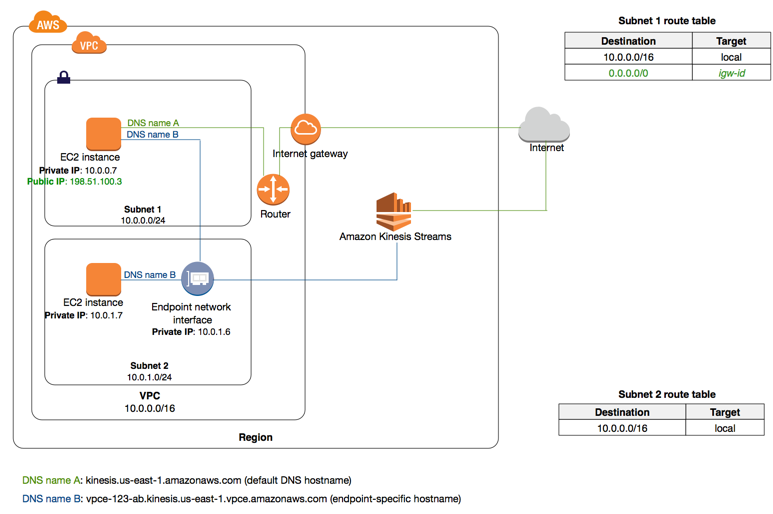
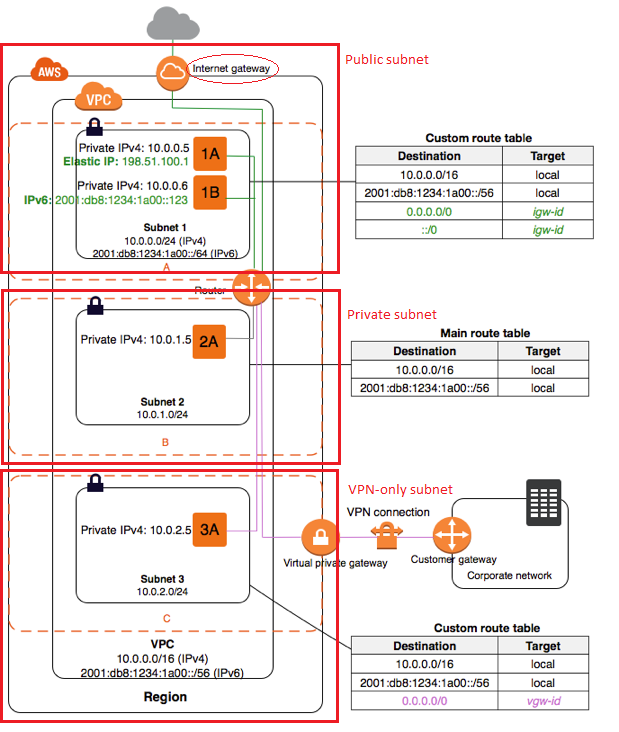
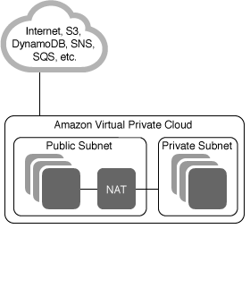
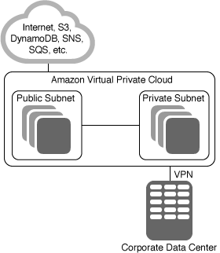

# Topic 3: VPC
- [Topic 3: VPC](#topic-3-vpc)
  - [1. What is Amazon VPC?](#1-what-is-amazon-vpc)
    - [1.1 VPCs and Subnets](#11-vpcs-and-subnets)
    - [1.2 Supported Platforms](#12-supported-platforms)
    - [1.3 Default and Nondefault VPCs](#13-default-and-nondefault-vpcs)
    - [1.4 Accessing the Internet](#14-accessing-the-internet)
    - [1.5 Accessing a Corporate or Home Network](#15-accessing-a-corporate-or-home-network)
    - [1.6 Accessing Services Through AWS PrivateLink](#16-accessing-services-through-aws-privatelink)
    - [1.7 AWS Private Global Network Considerations](#17-aws-private-global-network-considerations)
  - [2. VPC network components](#2-vpc-network-components)
  - [3. VPC and Subnets relationship](#3-vpc-and-subnets-relationship)
  - [4. Default VPC and Default Subnets](#4-default-vpc-and-default-subnets)
  - [5. IP Address](#5-ip-address)
  - [6. Security](#6-security)
  - [7. Scenarios and Examples](#7-scenarios-and-examples)
    - [Scenario 1: VPC with a Single Public Subnet](#scenario-1-vpc-with-a-single-public-subnet)
    - [Scenario 2: VPC with Public and Private Subnets (NAT)](#scenario-2-vpc-with-public-and-private-subnets-nat)
    - [Scenario 3: VPC with Public and Private Subnets and AWS Site-to-Site VPN Access](#scenario-3-vpc-with-public-and-private-subnets-and-aws-site-to-site-vpn-access)
    - [Scenario 4: VPC with a Private Subnet Only and AWS Site-to-Site VPN Access](#scenario-4-vpc-with-a-private-subnet-only-and-aws-site-to-site-vpn-access)
  - [References](#references)

## 1. What is Amazon VPC?
  - `Amazon Virtual Private Cloud (Amazon VPC)` enables you to launch AWS resources into a virtual network that you've defined. This virtual network closely resembles a traditional network that you'd operate in your own data center, with the benefits of using the scalable infrastructure of AWS.
  - Amazon VPC is the networking layer for Amazon EC2

### 1.1 VPCs and Subnets
  - A virtual private cloud (VPC) is a virtual network dedicated to your AWS account. It is logically isolated from other virtual networks in the AWS Cloud. You can launch your AWS resources, such as Amazon EC2 instances, into your VPC. You can specify an IP address range for the VPC, add subnets, associate security groups, and configure route tables.
  - A subnet is a range of IP addresses in your VPC. You can launch AWS resources into a specified subnet. Use a public subnet for resources that must be connected to the internet, and a private subnet for resources that won't be connected to the internet. For more information about public and private subnets
    + To protect the AWS resources in each subnet, you can use multiple layers of security, including security groups and network access control lists (ACL).
### 1.2 Supported Platforms
 - Accounts created:
   + Before 2013-12-04: Supported and can launch instances into either `EC2-Classic` or a VPC
   + After 2019-12-14: supported and launch into VPC only
 - By launching instances into a VPC instead of EC2-Classic, we can gain the ability to:
   + Assign static private IPv4 addresses to your instances that persist across starts and stops
   + Optionally associate an IPv6 CIDR (`Classless Inter-Domain Routing`) block to your VPC and assign IPv6 addresses to your instances
   + Assign multiple IP addresses to your instances
   + Define network interfaces, and attach one or more network interfaces to your instances
   + Change security group membership for your instances while they're running
   + Control the outbound traffic from your instances (egress filtering) in addition to controlling the inbound traffic to them (ingress filtering)
   + Add an additional layer of access control to your instances in the form of network access control lists (ACL)
   + Run your instances on single-tenant hardware

|   Characteristic    |    EC2-Classic   |  	Default VPC     |
|  ---  |  ---  |  ---  |
|   Public IPv4 address (from Amazon's public IP address pool)    |    Your instance receives a public IPv4 address from the EC2-Classic public IPv4 address pool.   |   Your instance launched in a default subnet receives a public IPv4 address by default, unless you specify otherwise during launch, or you modify the subnet's public IPv4 address attribute.    |
|  Private IPv4 address     |  Your instance receives a private IPv4 address from the EC2-Classic range each time it's started.     |    Your instance receives a static private IPv4 address from the address range of your default VPC.   |
|   Multiple private IPv4 addresses    |  An Elastic IP is disassociated from your instance when you stop it.     |  An Elastic IP remains associated with your instance when you stop it.     |
|    Associating an Elastic IP address   |   You associate an Elastic IP address with an instance.    |   An Elastic IP address is a property of a network interface. You associate an Elastic IP address with an instance by updating the network interface attached to the instance.    |
|   Reassociating an Elastic IP address    |  If the Elastic IP address is already associated with another instance, the address is automatically associated with the new instance.     |   If the Elastic IP address is already associated with another instance, the address is automatically associated with the new instance.    |
|   Tagging Elastic IP addresses    |   You cannot apply tags to an Elastic IP address.    |  You can apply tags to an Elastic IP address.     |
|   DNS hostnames    |    You cannot apply tags to an Elastic IP address.   |  You can apply tags to an Elastic IP address.     |
|   DNS hostnames    |    DNS hostnames are enabled by default.   |  DNS hostnames are enabled by default.     |
|    Security group   |  A security group can reference security groups that belong to other AWS accounts.     |  A security group can reference security groups for your VPC only.     |
|   Security group association   |   You can assign an unlimited number of security groups to an instance when you launch it. You can't change the security groups of your running instance. You can either modify the rules of the assigned security groups, or replace the instance with a new one (create an AMI from the instance, launch a new instance from this AMI with the security groups that you need, disassociate any Elastic IP address from the original instance and associate it with the new instance, and then terminate the original instance).    |    You can assign up to 5 security groups to an instance. You can assign security groups to your instance when you launch it and while it's running.   |
|    Security group rules   |   You can add rules for inbound traffic only.    |    You can add rules for inbound and outbound traffic.   |
|   Tenancy    |   Your instance runs on shared hardware.    |   You can run your instance on shared hardware or single-tenant hardware.    |
|   Accessing the Internet    |   Your instance can access the Internet. Your instance automatically receives a public IP address, and can access the Internet directly through the AWS network edge.    |    By default, your instance can access the Internet. Your instance receives a public IP address by default. An Internet gateway is attached to your default VPC, and your default subnet has a route to the Internet gateway.   |
|   IPv6 addressing    |   IPv6 addressing is not supported. You cannot assign IPv6 addresses to your instances    |  You can optionally associate an IPv6 CIDR block with your VPC, and assign IPv6 addresses to instances in your VPC.     |

### 1.3 Default and Nondefault VPCs
### 1.4 Accessing the Internet
  - You control how the instances that you launch into a VPC access resources outside the VPC.
  - Your default VPC includes an internet gateway, and each default subnet is a public subnet. Each instance that you launch into a default subnet has a private IPv4 address and a public IPv4 address. These instances can communicate with the internet through the internet gateway. An internet gateway enables your instances to connect to the internet through the Amazon EC2 network edge.

  - By default, each instance that you launch into a nondefault subnet has a private IPv4 address, but no public IPv4 address, unless you specifically assign one at launch, or you modify the subnet's public IP address attribute. These instances can communicate with each other, but can't access the internet.

  - You can enable internet access for an instance launched into a nondefault subnet by attaching an internet gateway to its VPC (if its VPC is not a default VPC) and associating an Elastic IP address with the instance.

  - Alternatively, to allow an instance in your VPC to initiate outbound connections to the internet but prevent unsolicited inbound connections from the internet, you can use a network address translation (NAT) device for IPv4 traffic. NAT maps multiple private IPv4 addresses to a single public IPv4 address. A NAT device has an Elastic IP address and is connected to the internet through an internet gateway. You can connect an instance in a private subnet to the internet through the NAT device, which routes traffic from the instance to the internet gateway, and routes any responses to the instance.

### 1.5 Accessing a Corporate or Home Network

  - You can optionally connect your VPC to your own corporate data center using an IPsec AWS Site-to-Site VPN connection, making the AWS Cloud an extension of your data center.

### 1.6 Accessing Services Through AWS PrivateLink

  - AWS PrivateLink is a highly available, scalable technology that enables you to privately connect your VPC to supported AWS services, services hosted by other AWS accounts (VPC endpoint services), and supported AWS Marketplace partner services. You do not require an internet gateway, NAT device, public IP address, AWS Direct Connect connection, or AWS Site-to-Site VPN connection to communicate with the service. Traffic between your VPC and the service does not leave the Amazon network.
  - To use AWS PrivateLink, create an interface VPC endpoint for a service in your VPC. This creates an elastic network interface in your subnet with a private IP address that serves as an entry point for traffic destined to the service

### 1.7 AWS Private Global Network Considerations
  - AWS provides a high-performance, and low-latency private global network that delivers a secure cloud computing environment to support your networking needs. AWS Regions are connected to multiple Internet Service Providers (ISPs) as well as to a private global network backbone, which provides improved network performance for cross-Region traffic sent by customers.

## 2. VPC network components
  - `A Virtual Private Cloud`: is a virtual network dedicated to your AWS account. It is logically isolated from other virtual networks in the AWS Cloud. You can launch your AWS resources, such as Amazon EC2 instances, into your VPC. You can specify an IP address range for the VPC, add subnets, associate security groups, and configure route tables.
  When you create a VPC, you must specify an IPv4 CIDR block for the VPC. The allowed block size is between a /16 netmask (65,536 IP addresses) and /28 netmask (16 IP addresses). After you've created your VPC, you can associate secondary CIDR blocks with the VPC. 

  
  - `Subnet`:  is a range of IP addresses in your VPC. You can launch AWS resources into a specified subnet. Use a public subnet for resources that must be connected to the internet, and a private subnet for resources that won't be connected to the internet.
  
  - `Internet Gateway`: The Amazon VPC side of a connection to the public Internet.
  
  - `NAT Gateway`: Network address translation (NAT) gateway is used to enable instances in a private subnet to connect to the internet or other AWS services, but prevent the internet from initiating a connection with those instances
  
  - `Peering Connection`: A peering connection enables you to route traffic via private IP addresses between two peered VPCs.
  

  - `VPC Endpoints`: Enables private connectivity to services hosted in AWS, from within your VPC without using an Internet Gateway, VPN, Network Address Translation (NAT) devices, or firewall proxies. Endpoints are virtual devices. There are two types of VPC endpoints: interface endpoints and gateway endpoints. Create the type of VPC endpoint required by the supported service.
    + An interface endpoint is an elastic network interface with a private IP address that serves as an entry point for traffic destined to a supported service. 
  
    + A gateway endpoint is a gateway that is a target for a specified route in your route table, used for traffic destined to a supported AWS service.
  

  - `Egress-only Internet Gateway`: A stateful gateway to provide egress only access for IPv6 traffic from the VPC to the Internet (that allows outbound communication over IPv6 from instances in your VPC to the Internet, and prevents the Internet from initiating an IPv6 connection with your instances.)
  

  - `Virtual Private Network (VPN)`
    + Create Customer Gateway: Specify the Internet-routable IP address for your gateway's external interface.
    + Virtual private gateway: The Amazon VPC side of a VPN connection.
    + Site-to-site VPN Connections: Mapping the virtual private gateway and customer gateway that you would like to connect via a VPN connection. 
  - `Network interface`
## 3. VPC and Subnets relationship
  - `VPC` 1<----->n `subnets`
  - Each `subnet` must reside entirely within one Availability Zone and cannot span zones
    + Availability Zones are distinct locations that are engineered to be isolated from failures in other Availability Zones

  - A `VPC` or `subnet` must have `IPv4 CIDR bock` and optional `IPv6 CIDR block`
  - The CIDR block of a `subnet` can be the same as the CIDR block for the `VPC` (in case `Single public subnet`) and cannot overlap in multiple subnets case
  - The first four IP addresses and the last IP address in each subnet CIDR block are not available for instances:
    + *First address*: Network address
    + *Second address*: Reserved by AWS for the VPC router
    + *Third address*: IP address of the DNS server
    + *Fourth address*: Reserved by AWS for future use
    + *Last address*: Network broadcast address
  - We can create a VPC with a publicly routable CIDR block that falls outside of the private IPv4 address ranges specified in RFC 1918
  - Multiple CIDR blocks in a VPC
  
    + We have two network address at here?
    + **Rules to add `IPv4 CIDR blocks` into `VPC`**
      - Block size is between `/28 netmask and /16 netmask`
      - CIDR blocks must not overlap
      - [Restriction on the ranges of IPv4](https://docs.aws.amazon.com/vpc/latest/userguide/VPC_Subnets.html#add-cidr-block-restrictions)
      - Cannot increase/decrease size of an existing CIDR block
      - `Subnets per VPC not over 200` - `IPv4 CIDR blocks per VPC not over 5` - `IPv6 CIDR blocks per VPC is always 1`
      - Range of CIDR block of subnet cannot > range of CIDR in any route tables <== Conflict with Single public subnet ?
      - If you've enabled your VPC for ClassicLink, you can associate CIDR blocks from the 10.0.0.0/16 and 10.1.0.0/16 ranges, but you cannot associate any other CIDR block from the 10.0.0.0/8 range
      - ...
      
      Note: Cannot disassociate the primary CIDR block of VPC
    + **Rules to add `IPv6 CIDR blocks` into `VPC`**
      - VPC default size: `prefix /56`
      - Subnet default size: `prefix /64`
      Note: Cannot disassociate any CIDR block of VPC, however, in next time, you cannot expect to receive the same CIDR block for setting
  - Subnet Routing:
    + Each subnet must be associated with a route table, which specifies the allowed routes for outbound traffic leaving the subnet
  - Subnet Security: `security groups` and `network ACLs`
    + `Security groups` control inbound and outbound traffic for `your instances`
    + `Network ACLs` control inbound and outbound traffic for `your subnets`
## 4. Default VPC and Default Subnets
  
  - `Default Subnet`is a public subnet
  - `public subnet` <----Remove/Add 0.0.0.0/0 igw-----> `private subnet`
  
## 5. IP Address
  - `Private IPv4 addresses` (also referred to as private IP addresses in this topic) are not reachable over the Internet, and can be used for communication between the instances in your VPC
  - `Public IPv4 Addresses` are reachable over the Internet
  - `IPv6 Addresses`
  - `Elastic IP Addresses`: is a static, public IPv4 address designed for dynamic cloud computing. You can associate an Elastic IP address with any instance or network interface for any VPC in your account. With an Elastic IP address, you can mask the failure of an instance by rapidly remapping the address to another instance in your VPC (the advantage of associating the Elastic IP address with the network interface instead of directly with the instance is that you can move all the attributes of the network interface from one instance to another in a single step)

## 6. Security
  - `Security`: AWS provides two features that you can use to increase security in your VPC: security groups and network ACLs. 
    + `Security groups` control inbound, outbound traffic and acts as a virtual firewall for your instance
    + `Network ACLs` is an optional layer of security for your VPC that acts as a firewall for controlling  inbound and outbound traffic for your subnets (a optional layer of security for your VPC that acts as a firewall)

## 7. Scenarios and Examples
### Scenario 1: VPC with a Single Public Subnet
  - Your instances run in a private, isolated section of the AWS cloud with direct access to the Internet. Network access control lists and security groups can be used to provide strict control over inbound and outbound network traffic to your instances.

  - Creates: A /16 network (VPC) with a /24 subnet. Public subnet instances use Elastic IPs or Public IPs to access the Internet.
  

### Scenario 2: VPC with Public and Private Subnets (NAT)
  - In addition to containing a public subnet, this configuration adds a private subnet whose instances are not addressable from the Internet. Instances in the private subnet can establish outbound connections to the Internet via the public subnet using Network Address Translation (NAT).
  - Creates: A /16 network (VPC) with two /24 subnets. Public subnet instances use Elastic IPs to access the Internet. Private subnet instances access the Internet via Network Address Translation (NAT). (Hourly charges for NAT devices apply.)

  

### Scenario 3: VPC with Public and Private Subnets and AWS Site-to-Site VPN Access
  - This configuration adds an IPsec Virtual Private Network (VPN) connection between your Amazon VPC and your data center - effectively extending your data center to the cloud while also providing direct access to the Internet for public subnet instances in your Amazon VPC.
  - Creates: A /16 network with two /24 subnets. One subnet is directly connected to the Internet while the other subnet is connected to your corporate network via IPsec VPN tunnel. (VPN charges apply.)

  

### Scenario 4: VPC with a Private Subnet Only and AWS Site-to-Site VPN Access
  - Your instances run in a private, isolated section of the AWS cloud with a private subnet whose instances are not addressable from the Internet. You can connect this private subnet to your corporate data center via an IPsec Virtual Private Network (VPN) tunnel.
  - Creates: A /16 network with a /24 subnet and provisions an IPsec VPN tunnel between your Amazon VPC and your corporate network. (VPN charges apply.)

  

## References
[Amazon VPC](https://docs.aws.amazon.com/en_us/vpc/latest/userguide/what-is-amazon-vpc.html)
[EC2-Classic and VPC comparision](https://docs.aws.amazon.com/en_us/AWSEC2/latest/UserGuide/ec2-classic-platform.html)