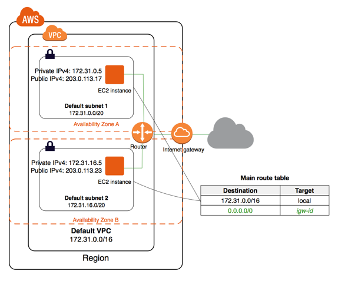
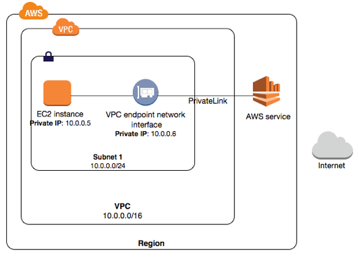

# Topic 3: VPC
- [Topic 3: VPC](#topic-3-vpc)
  - [1. What is Amazon VPC?](#1-what-is-amazon-vpc)
    - [1.1 VPCs and Subnets](#11-vpcs-and-subnets)
    - [1.2 Supported Platforms](#12-supported-platforms)
    - [1.3 Default and Nondefault VPCs](#13-default-and-nondefault-vpcs)
    - [1.4 Accessing the Internet](#14-accessing-the-internet)
    - [1.5 Accessing a Corporate or Home Network](#15-accessing-a-corporate-or-home-network)
    - [1.6 Accessing Services Through AWS PrivateLink](#16-accessing-services-through-aws-privatelink)
    - [1.7 AWS Private Global Network Considerations](#17-aws-private-global-network-considerations)
  - [2. Practices](#2-practices)
    - [2.1 VPC with IPv4](#21-vpc-with-ipv4)
    - [2.2 VPC with IPv6](#22-vpc-with-ipv6)
  - [References](#references)

## 1. What is Amazon VPC?
  - `Amazon Virtual Private Cloud (Amazon VPC)` enables you to launch AWS resources into a virtual network that you've defined. This virtual network closely resembles a traditional network that you'd operate in your own data center, with the benefits of using the scalable infrastructure of AWS.
  - Amazon VPC is the networking layer for Amazon EC2

### 1.1 VPCs and Subnets
  - A virtual private cloud (VPC) is a virtual network dedicated to your AWS account. It is logically isolated from other virtual networks in the AWS Cloud. You can launch your AWS resources, such as Amazon EC2 instances, into your VPC. You can specify an IP address range for the VPC, add subnets, associate security groups, and configure route tables.
  - A subnet is a range of IP addresses in your VPC. You can launch AWS resources into a specified subnet. Use a public subnet for resources that must be connected to the internet, and a private subnet for resources that won't be connected to the internet. For more information about public and private subnets
    + To protect the AWS resources in each subnet, you can use multiple layers of security, including security groups and network access control lists (ACL).
### 1.2 Supported Platforms
 - Accounts created:
   + Before 2013-12-04: Supported and can launch instances into either `EC2-Classic` or a VPC
   + After 2019-12-14: supported and launch into VPC only
 - By launching instances into a VPC instead of EC2-Classic, we can gain the ability to:
   + Assign static private IPv4 addresses to your instances that persist across starts and stops
   + Optionally associate an IPv6 CIDR (`Classless Inter-Domain Routing`) block to your VPC and assign IPv6 addresses to your instances
   + Assign multiple IP addresses to your instances
   + Define network interfaces, and attach one or more network interfaces to your instances
   + Change security group membership for your instances while they're running
   + Control the outbound traffic from your instances (egress filtering) in addition to controlling the inbound traffic to them (ingress filtering)
   + Add an additional layer of access control to your instances in the form of network access control lists (ACL)
   + Run your instances on single-tenant hardware

|   Characteristic    |    EC2-Classic   |  	Default VPC     |
|  ---  |  ---  |  ---  |
|   Public IPv4 address (from Amazon's public IP address pool)    |    Your instance receives a public IPv4 address from the EC2-Classic public IPv4 address pool.   |   Your instance launched in a default subnet receives a public IPv4 address by default, unless you specify otherwise during launch, or you modify the subnet's public IPv4 address attribute.    |
|  Private IPv4 address     |  Your instance receives a private IPv4 address from the EC2-Classic range each time it's started.     |    Your instance receives a static private IPv4 address from the address range of your default VPC.   |
|   Multiple private IPv4 addresses    |  An Elastic IP is disassociated from your instance when you stop it.     |  An Elastic IP remains associated with your instance when you stop it.     |
|    Associating an Elastic IP address   |   You associate an Elastic IP address with an instance.    |   An Elastic IP address is a property of a network interface. You associate an Elastic IP address with an instance by updating the network interface attached to the instance.    |
|   Reassociating an Elastic IP address    |  If the Elastic IP address is already associated with another instance, the address is automatically associated with the new instance.     |   If the Elastic IP address is already associated with another instance, the address is automatically associated with the new instance.    |
|   Tagging Elastic IP addresses    |   You cannot apply tags to an Elastic IP address.    |  You can apply tags to an Elastic IP address.     |
|   DNS hostnames    |    You cannot apply tags to an Elastic IP address.   |  You can apply tags to an Elastic IP address.     |
|   DNS hostnames    |    DNS hostnames are enabled by default.   |  DNS hostnames are enabled by default.     |
|    Security group   |  A security group can reference security groups that belong to other AWS accounts.     |  A security group can reference security groups for your VPC only.     |
|   Security group association   |   You can assign an unlimited number of security groups to an instance when you launch it. You can't change the security groups of your running instance. You can either modify the rules of the assigned security groups, or replace the instance with a new one (create an AMI from the instance, launch a new instance from this AMI with the security groups that you need, disassociate any Elastic IP address from the original instance and associate it with the new instance, and then terminate the original instance).    |    You can assign up to 5 security groups to an instance. You can assign security groups to your instance when you launch it and while it's running.   |
|    Security group rules   |   You can add rules for inbound traffic only.    |    You can add rules for inbound and outbound traffic.   |
|   Tenancy    |   Your instance runs on shared hardware.    |   You can run your instance on shared hardware or single-tenant hardware.    |
|   Accessing the Internet    |   Your instance can access the Internet. Your instance automatically receives a public IP address, and can access the Internet directly through the AWS network edge.    |    By default, your instance can access the Internet. Your instance receives a public IP address by default. An Internet gateway is attached to your default VPC, and your default subnet has a route to the Internet gateway.   |
|   IPv6 addressing    |   IPv6 addressing is not supported. You cannot assign IPv6 addresses to your instances    |  You can optionally associate an IPv6 CIDR block with your VPC, and assign IPv6 addresses to instances in your VPC.     |

### 1.3 Default and Nondefault VPCs
### 1.4 Accessing the Internet
  - You control how the instances that you launch into a VPC access resources outside the VPC.
  - Your default VPC includes an internet gateway, and each default subnet is a public subnet. Each instance that you launch into a default subnet has a private IPv4 address and a public IPv4 address. These instances can communicate with the internet through the internet gateway. An internet gateway enables your instances to connect to the internet through the Amazon EC2 network edge.

  - By default, each instance that you launch into a nondefault subnet has a private IPv4 address, but no public IPv4 address, unless you specifically assign one at launch, or you modify the subnet's public IP address attribute. These instances can communicate with each other, but can't access the internet.

  - You can enable internet access for an instance launched into a nondefault subnet by attaching an internet gateway to its VPC (if its VPC is not a default VPC) and associating an Elastic IP address with the instance.

  - Alternatively, to allow an instance in your VPC to initiate outbound connections to the internet but prevent unsolicited inbound connections from the internet, you can use a network address translation (NAT) device for IPv4 traffic. NAT maps multiple private IPv4 addresses to a single public IPv4 address. A NAT device has an Elastic IP address and is connected to the internet through an internet gateway. You can connect an instance in a private subnet to the internet through the NAT device, which routes traffic from the instance to the internet gateway, and routes any responses to the instance.

### 1.5 Accessing a Corporate or Home Network

  - You can optionally connect your VPC to your own corporate data center using an IPsec AWS Site-to-Site VPN connection, making the AWS Cloud an extension of your data center.

### 1.6 Accessing Services Through AWS PrivateLink

  - AWS PrivateLink is a highly available, scalable technology that enables you to privately connect your VPC to supported AWS services, services hosted by other AWS accounts (VPC endpoint services), and supported AWS Marketplace partner services. You do not require an internet gateway, NAT device, public IP address, AWS Direct Connect connection, or AWS Site-to-Site VPN connection to communicate with the service. Traffic between your VPC and the service does not leave the Amazon network.
  - To use AWS PrivateLink, create an interface VPC endpoint for a service in your VPC. This creates an elastic network interface in your subnet with a private IP address that serves as an entry point for traffic destined to the service

### 1.7 AWS Private Global Network Considerations
  - AWS provides a high-performance, and low-latency private global network that delivers a secure cloud computing environment to support your networking needs. AWS Regions are connected to multiple Internet Service Providers (ISPs) as well as to a private global network backbone, which provides improved network performance for cross-Region traffic sent by customers.

## 2. Practices
### 2.1 VPC with IPv4

### 2.2 VPC with IPv6

## References
[Amazon VPC](https://docs.aws.amazon.com/en_us/vpc/latest/userguide/what-is-amazon-vpc.html)
[EC2-Classic and VPC comparision](https://docs.aws.amazon.com/en_us/AWSEC2/latest/UserGuide/ec2-classic-platform.html)